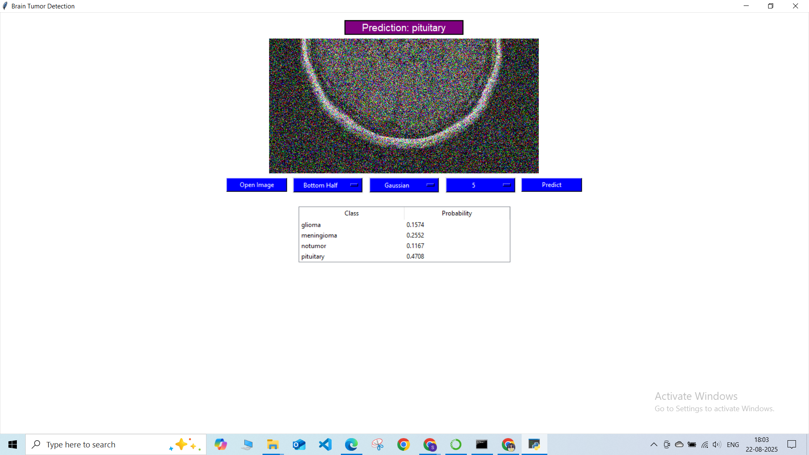

# 🧠 Brain-Tumor-Classification-ViT

This repository contains the code for a **Brain Tumor Classification System** using **Vision Transformers (ViTs)**.  
The model classifies MRI brain images into **four categories**:
- Glioma  
- Meningioma  
- Pituitary  
- No Tumor  

This project was developed as part of our **Capstone Project**.

---

## ✨ Key Features
- 🎯 **High Accuracy:** Achieves 99.6% accuracy on clean images.  
- 🛡️ **Robustness to Noise:** Performs well on noisy / cropped MRI images.  
- 🖥️ **Graphical User Interface (GUI):** Simple Tkinter app for predictions.  
- 📦 **Cross-Platform Deployment:** Packaged as a Windows executable.  

---

## 📊 GUI & Results

### Application Interface  
  

### Sample Prediction Result  
  

  

  

### Project Poster  
  

---

## ⚙️  Installation

### Option 1: Use Executable  
Download the pre-built executable file here:  
👉 [Download EXE](https://github.com/ShrutiPatil7111/Brain-Tumor-Classification-ViT/releases/tag/v01)

### Option 2: Run from Source  
1. Clone the repo:  
   ```bash
   git clone https://github.com/ShrutiPatil7111/Brain-Tumor-Classification-ViT.git
   cd Brain-Tumor-Classification-ViT

2. Install dependencies:
   ```bash
   pip install -r requirements.txt
   
3. Run the app:
   ```bash
   python brain_tumor_detection_app.py

---

**🖥️ Usage:**

1. **Load an MRI image** using the file browser.
2. **Select optional preprocessing steps:**
   - Cropping 
   - Noise addition (Gaussian, Salt & Pepper, Speckle)
3. **Click "Predict"** to classify the tumor.
4. **View the classification results:** The predicted tumor type and probabilities will be displayed.

---

**🛠️ Tech Stack:**

* **Deep Learning:** PyTorch, Hugging Face Transformers
* **Preprocessing:** Scikit-image, Pillow
* **GUI:** Tkinter
* **Packaging:** PyInstaller

---

**📌 Notes:**

* Requires GPU for faster inference (CPU also supported, but slower). 
* The dataset is not included due to licensing; pre-trained model weights are bundled in the .exe.

---

**👩‍💻 Team:**

* Shruti Patil 
* Om Jadhav
* Khushi Deshmukh
* Atharv Kabade

---

**🚀 Contributing:**

Contributions to this project are welcome. Please feel free to fork the repository and submit pull requests.

---
